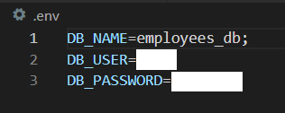
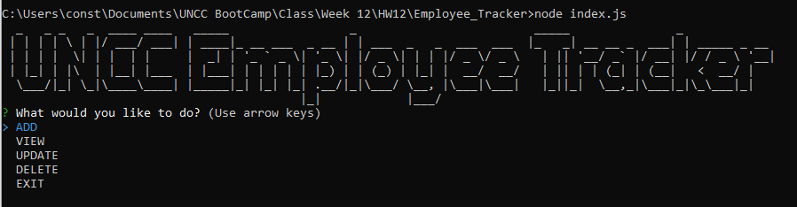
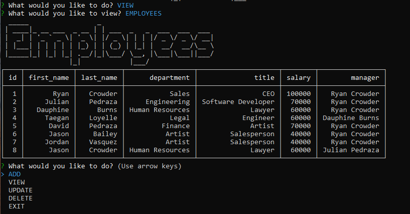
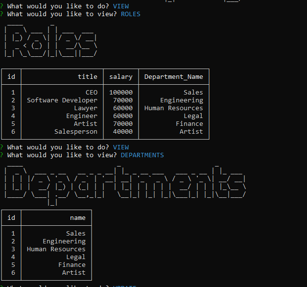
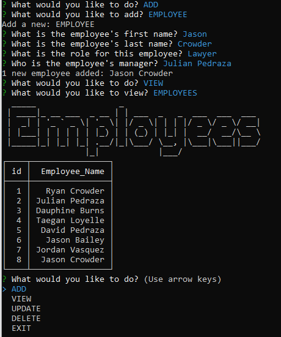
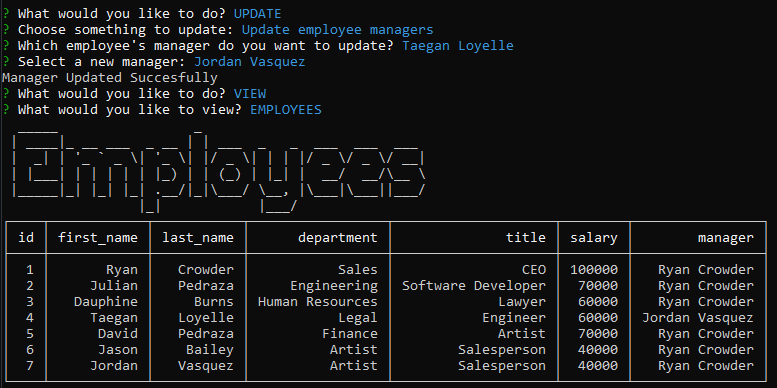
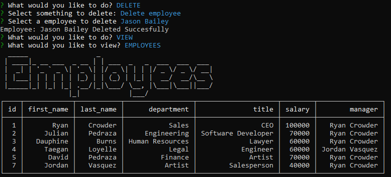

# #12: Employee Tracker

## Description: Console Terminal App to display, update, and delete entries in an Employee Registry .

Link to Video: [Employee Tracker Walkthrough](https://drive.google.com/file/d/1IzkaO0d_rI96uTz7oVRVd3NUMWxEIPvn/view?usp=sharing)

 

# Installation:

- Run:

                npm i

---

                node start

- Security:

# Usage:

- Start-up:

- Viewing:

- Adding:

- Updating:

- Deleting:

# Questions: https://github.com/Crowderyan

### Email me: <a href="mailto:Rebuiltrival@gmail.com" hspace="20">Rebuiltrival@gmail.com</a>
